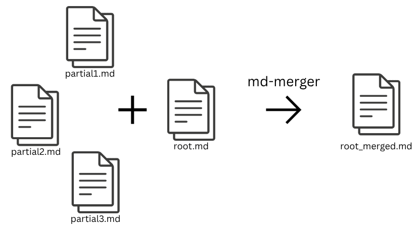

# md-merger

<figure style="text-align:center;">
				

<figcaption style="font-weight: bold;font-size:0.75rem;text-align:center;">md-merger Flow</figcaption>
</figure>


**md-merger** merges multiple "partial" markdown documents into a single file.
The base for the new document is a root-File (you can call it what you want) which holds all references to the
partials that shall be part of the outfile.

Partials area identified by a comment (`<!-- partial:filename.md -->`) in the rootfile.

_Relative Links to Images and Files will be updated so they remain working in the outfile._

## Examples

**root.md**
```md
# Root
The following comment is used to import content.
<!-- merge:partials/content.md -->
```

**partials/content.md**
```md
# Content
Lorem Ipsum Dolor

```

By running the following command the merged file will be created.

```bash
md-merger merge -input root.md
```

The result will be the following markdown

**root_merged.md**
```md
# Root
The following comment is used to import content.
# Content
Lorem Ipsum Dolor

```

## Commands

**merge**
```bash
md-merger merge [options]
```

**help**
```bash
md-merger help
```

## Options

|Option|Required|Description|
|---|---|---|
|-i, --input|✅|Rootfile path|
|-o, --output|❌|Name of the output file. Default is `{inputFileName}_merged.md`|


## Development

**Compiling to executbale (Linux)**
```bash
GOOS=linux GOARCH=amd64 go build -o build/linux/md-merger main.go
```

**Compiling to executbale (Windows)**
```bash
GOOS=windows GOARCH=amd64 go build -o build/win/md-merger.exe main.go
```